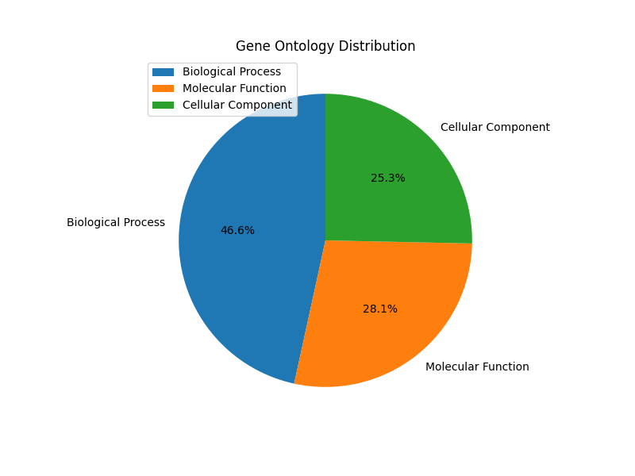
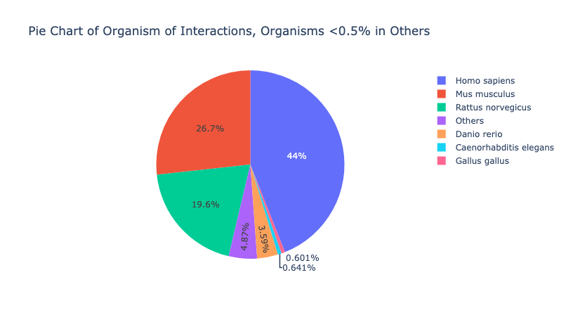
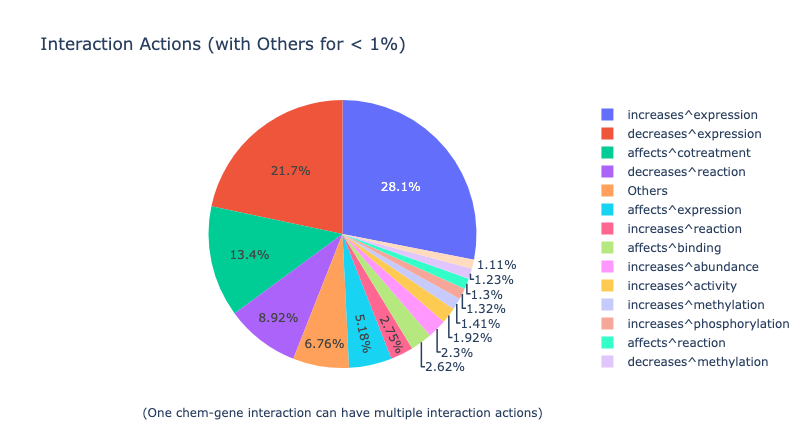
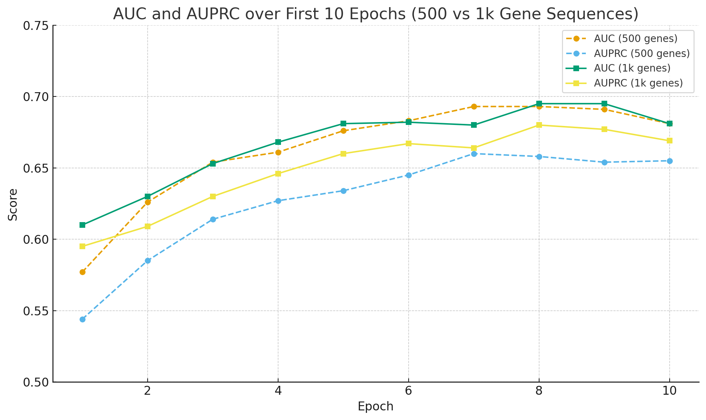

# DrugGene: Multimodal Drug–Gene Interaction Classification

This repository provides a training pipeline for predicting **drug–gene interaction direction** i.e. whether a drug *increases* or *decreases* the expression of a target gene.

We explore two key modeling setups:

1. **Bilinear-fusion model** using **mean-pooled gene and drug embeddings**, with experiments comparing **GCN vs GIN** for drug encoders (inspired by [DrugChat](#citations)). Transitioning from GCN to GIN and unfreezing drug encoder improved validation loss by 5%.

2. **Cross-attention fusion model** using **DNABERT-filtered gene sequences** (≤500 and ≤1000 tokens) combined with drug graph embeddings. AUC and AUPRC peaked around **0.70** — see plot below.

---

## Contributions

- **Dataset Construction**  
  Scraped and integrated over **2.5 million drug–gene interactions** from public sources including CTD, PubChem, and NCBI. Each entry includes:
  - SMILES representation (drug structure)
  - Gene ID and DNA sequence
  - Description of interaction
  - Data distribution for the full dataset 

| Ontology | Organism | Interaction Actions |
|---|---|---|
|  |  |  |

  Full raw dataset can be found here: https://drive.google.com/file/d/11xEVXHGkf-9xIkgsn6lW04DhDcXiHpkI/view?usp=drive_link
  

- **Expression Modulation Task**  
  This work focuses on predicting **how** a drug modulates gene expression, which is a less commonly explored task than binary drug–target interaction (DTI) prediction. The dataset filtered specifically for this direction-label prediction task can be found here - https://drive.google.com/drive/folders/17JQhsiVpkugNg1W_R7rcsvdPFtGtETqI?usp=drive_link

---

## Model Overview

- **Multimodal Inputs**
  - **Gene Sequences** → Mean-pooled embeddings from DNABERT (precomputed and provided for ≤1000 token sequences). Full-sequence embeddings can be reproduced using the DNABERT model.
  - **Drug Molecules** → Graph neural networks (**GIN** or **GCN**) trained over molecular graphs derived from SMILES, with attention pooling.
  
- **Bilinear Fusion**  
  Gene and drug representations are pooled and fused using a bilinear interaction gate followed by gated projections, capturing multiplicative and difference-based relationships between the modalities.

- **Transformer-style Cross-Attention**  
  When enabled (`use_xattn=True`), a transformer block performs symmetric cross-attention between gene and drug embeddings, enabling bidirectional contextualization before final pooling and classification.

---

## Dataset Format

- **Genes**: Stored in LMDB format, indexed by gene ID
- **Drugs**: Preprocessed into PyTorch Geometric `Data` objects from SMILES strings and cached
- **Pairs**: A CSV file defines training/validation/test splits with corresponding interaction direction labels

The expression-modulation prediction dataset can be accessed from:
https://drive.google.com/drive/folders/17JQhsiVpkugNg1W_R7rcsvdPFtGtETqI?usp=drive_link

---

## Results

### AUC and AUPRC across Epochs (500 vs 1000-token Gene Sequences)

- AUC and AUPRC both improve steadily for the first 7–8 epochs and then plateau
- Performance for 1K-token inputs slightly exceeds that of 500-token inputs
- Final AUC ~0.695, indicating meaningful signal capture beyond class imbalance baseline

---

## Citations

This project builds upon prior work in drug and gene representation learning.

### DNABERT-2  
Zhou, Z., Ji, Y., Li, W., Dutta, P., Davuluri, R., & Liu, H. (2023).  
**DNABERT-2: Efficient Foundation Model and Benchmark For Multi-Species Genome**.  
*arXiv preprint* [arXiv:2306.15006](https://arxiv.org/abs/2306.15006)

### DrugChat  
Liang, Y., et al. (2023).  
**Multi-Modal Large Language Model Enables All-Purpose Prediction of Drug Mechanisms and Properties**.  
[https://doi.org/10.1101/2024.09.29.615524](https://doi.org/10.1101/2024.09.29.615524)
